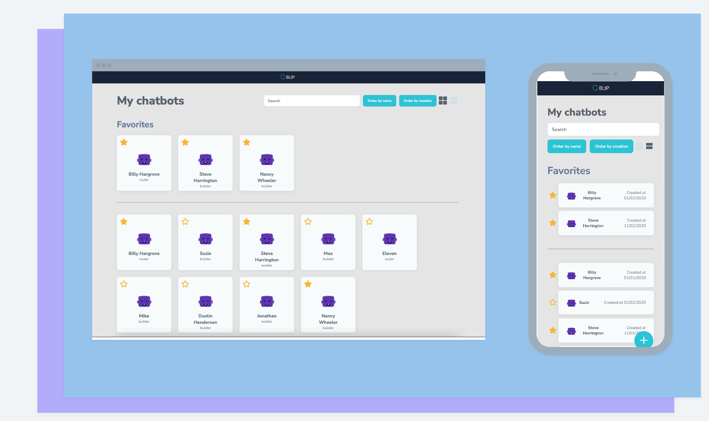
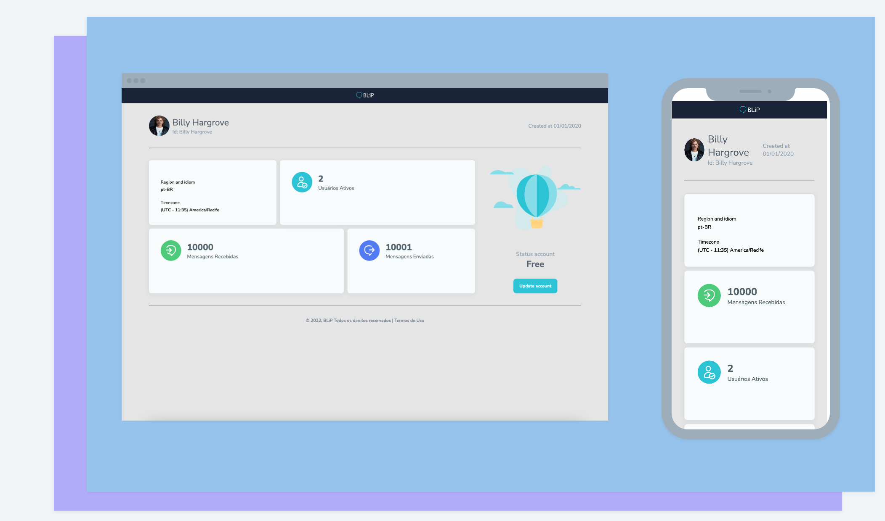

  

<h1 align="center">My Chat Bots</h1>

<h3 align="center">
  
  
</h3>

## Overview | :book:

My Chat Bots is a platform to add, favorite and list your chats bots. 🦾

## Presentation | :camera_flash:

---

## Techs | 🚀

- ReactJS;
- Typescript;
- Axios;
- Styled-Components.
- Vitest;
- React Testing Library

## Deployment | :cloud:

- [Vercel]()

---

With 💜 by Johelder

